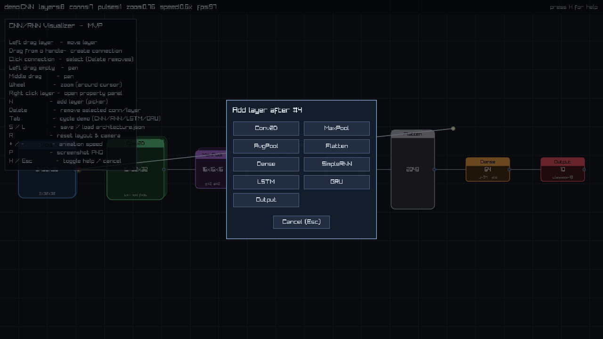
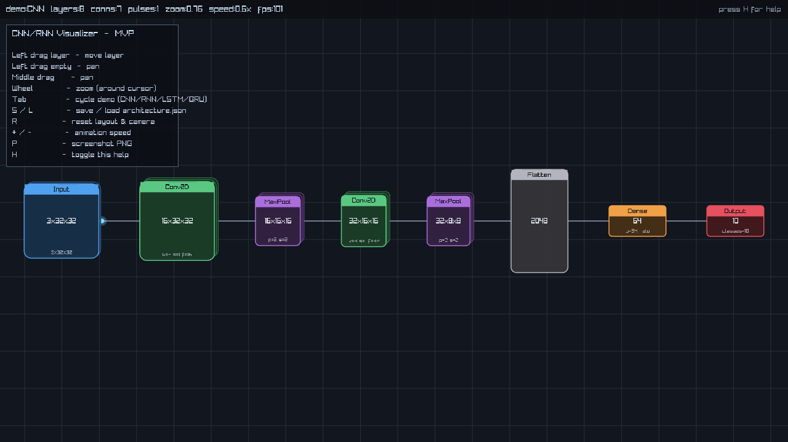
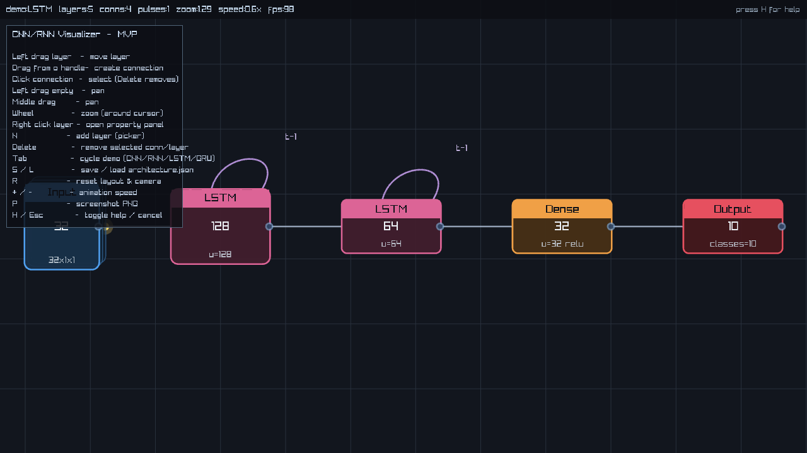
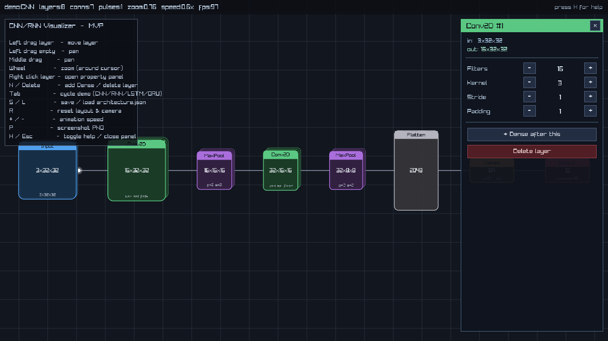
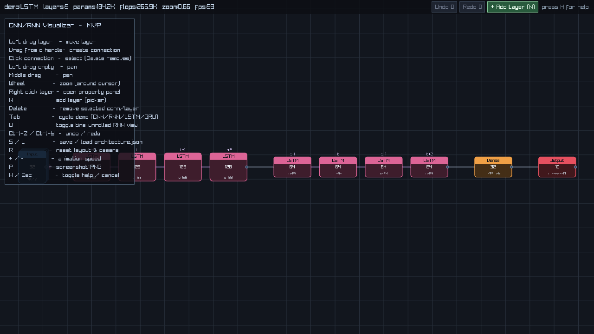

# nn-odinray

[](https://github.com/phiat/nn-odinray/actions/workflows/release.yml)
[](LICENSE)
[](https://odin-lang.org/)
[](https://www.raylib.com/)
[](#building)

An interactive 2D visualizer for **CNN and RNN architectures**, written in [Odin](https://odin-lang.org/) on top of [raylib](https://www.raylib.com/). Native, lightweight, real-time. Designed as a faster, more focused alternative to web-only tools like TensorFlow Playground.



## Features

- **Layer types**: `Input`, `Conv2D`, `MaxPool`, `AveragePool`, `Flatten`, `Dense`, `SimpleRNN`, `LSTM`, `GRU`, `Output`.
- **Live animated forward pass**: colored pulses propagate along connections; speed adjustable at runtime.
- **Recurrent self-loops**: `SimpleRNN`/`LSTM`/`GRU` layers render with a `t-1` self-loop arc.
- **Time-unrolled RNN view**: press `U` to expand recurrent layers into N copies labelled `t-1`, `t`, `t+1`, `t+2` and connected by explicit time-step arrows. Downstream layers shift right automatically; render-only, no data-model change.
- **Multi-channel feature maps**: layers with channels > 1 render with offset "stacked card" shadows scaled by channel count.
- **Parameter count and FLOPs**: live totals in the status bar, plus per-layer numbers in the property panel. Standard formulas (Conv: `(k²·in_ch+1)·filters`; LSTM: `4·(in+units+1)·units`; MAC counted as 2 FLOPs). Bump a `filters` value and watch the totals jump.
- **Full graph editor**:
  - Right-click any layer to open a property panel with `-`/`+` and `<`/`>` controls.
  - `N` (or the **+ Add Layer** toolbar button) opens a layer-type picker.
  - Drag from a layer's right-edge handle to another layer to create a connection.
  - Click a connection to select it; `Delete` removes it.
  - Move any layer with left-drag; pan with middle-drag; zoom around the cursor with the mouse wheel.
- **Live shape propagation**: editing any param (filters, kernel, units, etc.) re-derives `output_shape` and propagates `input_shape` through the rest of the graph via a topological forward pass.
- **Undo / Redo** with `Ctrl+Z` / `Ctrl+Y` (depth 64), plus toolbar buttons that show stack depth.
- **JSON persistence**: `S` saves to `architecture.json`, `L` loads. Pretty-printed and hand-editable.
- **Screenshot export**: `P` writes `visualizer_NNN.png`.
- **Four built-in demos**: CNN, SimpleRNN, LSTM, GRU. `Tab` cycles between them.

## Screenshots

| | |
|---|---|
|  |  |
| **CNN forward pass** with animated pulses, multi-channel stacked feature maps. | **LSTM** with recurrent self-loop arcs and output handles. |
|  |  |
| **Property panel** with live in/out shapes, param count and FLOPs. | **Layer picker** modal — pick any of 9 layer types. |
|  | |
| **Time-unrolled** LSTM: each recurrent layer expanded into 4 copies (`t-1`…`t+2`) with explicit time-step arrows. | |

## Building

Requires the Odin compiler with the vendored raylib bindings (default in current Odin builds).

```sh
odin build . -out:nn-odinray
./nn-odinray
```

Tested on Odin `dev-2026-05` with raylib 5.5. The code uses only `core:` and `vendor:raylib`, so no external dependencies beyond the toolchain.

## CLI flags

| Flag | Effect |
|---|---|
| `--demo cnn\|rnn\|lstm\|gru` | Pick the startup demo (default: `cnn`). |
| `--unrolled` | Start with the time-unrolled RNN view enabled. |
| `--shot <path.png>` | Render ~30 frames then save the screen to a PNG and exit. Useful for headless verification. |
| `--save-test <path.json>` | Save the chosen demo, immediately re-load it, and print a round-trip summary. |
| `--shape-test` | Run shape-propagation tests (mutate, delete, insert) and print derived shapes. |

## Controls

### Mouse
| Input | Action |
|---|---|
| Left-drag on layer | Move layer |
| Left-drag from output handle (right-edge dot) | Create new connection (drop on target layer) |
| Left-click on connection | Select connection (then `Delete` to remove) |
| Left-drag on empty canvas | Pan |
| Middle-drag | Pan |
| Right-click on layer | Open property panel |
| Wheel | Zoom (anchored at cursor) |

### Keyboard
| Key | Action |
|---|---|
| `N` | Open layer-type picker |
| `Delete` / `Backspace` | Remove selected connection (or hovered/selected layer) |
| `Ctrl+Z` / `Ctrl+Y` | Undo / Redo |
| `Tab` | Cycle between demo architectures |
| `U` | Toggle time-unrolled RNN view |
| `S` / `L` | Save / Load `architecture.json` |
| `R` | Re-run auto-layout and re-fit camera |
| `+` / `-` | Adjust animation speed |
| `P` | Save screenshot PNG |
| `H` | Toggle the help panel |
| `Esc` | Close picker / cancel connection drag / close panel |

## Architecture file format

The JSON format is intentionally flat and human-editable:

```json
{
  "version": 1,
  "anim_speed": 0.6,
  "layers": [
    {
      "id": 0,
      "type": "input",
      "pos": [80.0, 308.0],
      "input_shape": [3, 32, 32],
      "output_shape": [3, 32, 32],
      "params": { "channels": 3, "height": 32, "width": 32 }
    },
    {
      "id": 1,
      "type": "conv2d",
      "pos": [260.0, 270.0],
      "input_shape": [3, 32, 32],
      "output_shape": [16, 32, 32],
      "params": { "filters": 16, "kernel": 3, "stride": 1, "padding": 1 }
    }
  ],
  "connections": [
    { "from": 0, "to": 1, "weight": 1.0 }
  ]
}
```

Layer `type` values: `input`, `conv2d`, `maxpool`, `avgpool`, `flatten`, `dense`, `rnn`, `lstm`, `gru`, `output`.

Param fields not relevant to a given layer type are written as zero/empty but ignored on load.

## Source layout

```
main.odin         window/loop, input handling, CLI flags, undo/redo wiring
visualizer.odin   data model, layout, drawing, animation, shape propagation, JSON I/O, history
ui.odin          toolbar, status bar, help panel, property panel, layer picker
```

~1500 lines of Odin across the three files. No external libraries beyond Odin's `core:` and `vendor:raylib`.

## Non-goals

This project is *visualization only*. It deliberately does not:

- Train models or run backpropagation.
- Render activation values per-pixel (deferred — would require a sampling backend).
- Render in 3D (raylib's 2D pipeline is enough for this scope).
- Implement a full deep-learning framework.

## License

[MIT](LICENSE) © phiat
